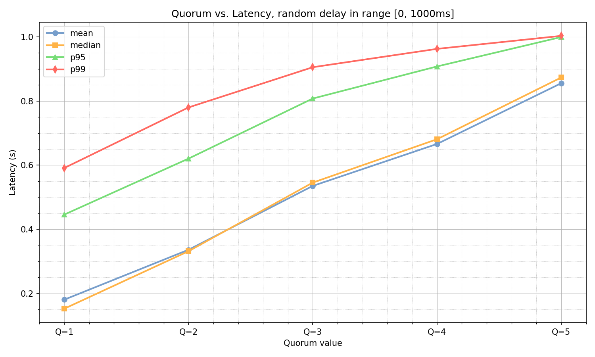
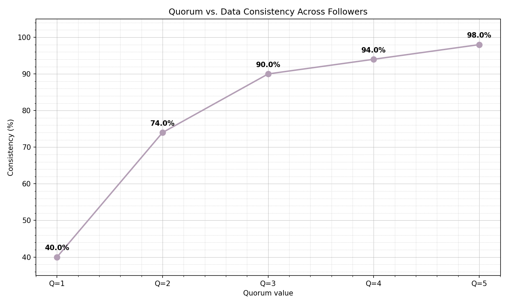
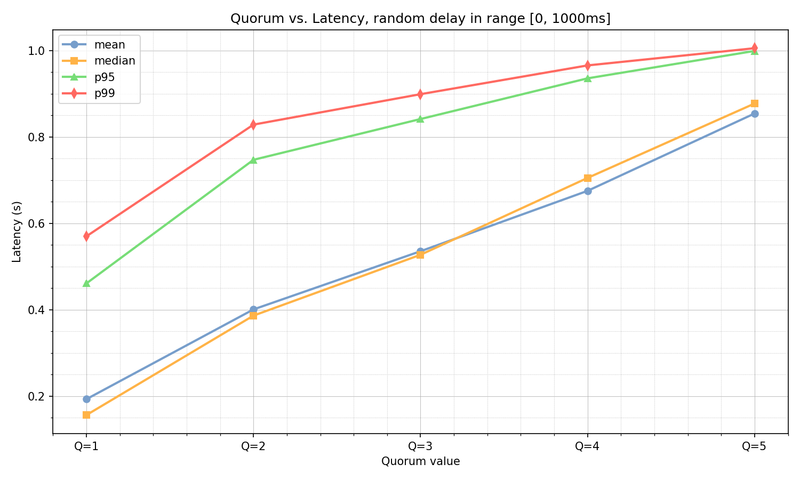
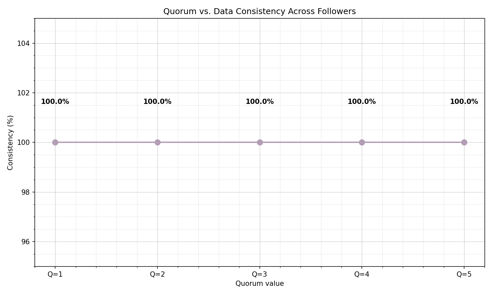

# Lab 4: Leaders and Followers - Single-Leader Replication

A distributed key-value store implementing **single-leader replication** with semi-synchronous writes, configurable write quorum, and simulated network delays. Based on concepts from Chapter 5 of "Designing Data-Intensive Applications" by Martin Kleppmann.

---

## Project Structure

```
PR-lab4-LeadersAndFollowers/
├── LeadersAndFollowers/                # Main ASP.NET Core application
│   ├── Program.cs                      # Application entry point, endpoint definitions
│   ├── Models/
│   │   ├── AppConfig.cs                # Configuration parsing from env vars/appsettings
│   │   ├── NodeRole.cs                 # Enum: Leader or Follower
│   │   ├── ReplicationCommand.cs       # DTO for replication requests (key, value, version)
│   │   ├── WriteResult.cs              # Response model for write operations
│   │   ├── ConfigResult.cs             # Response model for config endpoint
│   │   └── ConfigUpdate.cs             # Request model for config updates
│   ├── Services/
│   │   ├── KeyValueStore.cs            # Thread-safe in-memory store with versioning
│   │   ├── LeaderWriteService.cs       # Semi-sync replication with quorum logic
│   │   └── ReplicationClient.cs        # HTTP client with simulated network delay
│   ├── appsettings.json                # Base configuration
│   ├── appsettings.Leader.json         # Leader-specific config (local dev)
│   └── appsettings.Follower.json       # Follower-specific config (local dev)
│
├── LeadersAndFollowers.IntegrationTests/
│   └── ReplicationTests.cs             # Integration tests for the cluster
│
├── results/                            # Analysis output (JSON stores, plots)
│   ├── q1/ ... q5/                     # Per-quorum snapshots
│   ├── quorum_latency_analysis.png     # Latency vs quorum plot
│   └── quorum_consistency_analysis.png # Consistency vs quorum plot
│
├── docker-compose.yml                  # 1 leader + 5 followers configuration
├── Dockerfile                          # Multi-stage .NET build
├── run.sh                              # Start containers with optional overrides
├── test.sh                             # Run integration tests
├── analyze.sh                          # Run performance analysis
├── checker.py                          # Performance analysis script
└── README.md                           # This file
```

---

## Features

- **Single-Leader Replication**: Only the leader accepts writes; followers receive replicated data
- **Semi-Synchronous Replication**: Leader waits for configurable quorum before confirming writes
- **Configurable Write Quorum**: Set via `WRITE_QUORUM` environment variable (1-5)
- **Simulated Network Delay**: Random delay in `[MIN_DELAY_MS, MAX_DELAY_MS]` range
- **Version-Based Conflict Resolution**: Optional versioning to handle out-of-order replication
- **Concurrent Request Handling**: All nodes process requests concurrently
- **Docker Compose Deployment**: 1 leader + 5 followers in isolated network

---

## Docker Configuration

### Dockerfile

```dockerfile
# Multi-stage build for smaller final image
FROM mcr.microsoft.com/dotnet/aspnet:10.0-alpine AS base
WORKDIR /app

ENV ASPNETCORE_URLS=http://+:8080    # Listen on all interfaces
EXPOSE 8080

FROM mcr.microsoft.com/dotnet/sdk:10.0-alpine AS build
WORKDIR /src

COPY LeadersAndFollowers/LeadersAndFollowers.csproj LeadersAndFollowers/
RUN dotnet restore LeadersAndFollowers/LeadersAndFollowers.csproj

COPY . .
RUN dotnet publish LeadersAndFollowers/LeadersAndFollowers.csproj \
    -c Release -o /app/publish /p:UseAppHost=false

FROM base AS final
WORKDIR /app
COPY --from=build /app/publish .
ENTRYPOINT ["dotnet", "LeadersAndFollowers.dll"]
```

**Key points:**
- Uses Alpine-based images for minimal size
- Multi-stage build separates SDK (build) from runtime
- Listens on `http://+:8080` to accept connections from any interface

### docker-compose.yml

```yaml
services:
  leader:
    build:
      context: .
      dockerfile: Dockerfile
    container_name: leader
    environment:
      ASPNETCORE_ENVIRONMENT: "Leader"           # Uses appsettings.Leader.json
      WRITE_QUORUM: "${WRITE_QUORUM:-3}"         # Default quorum = 3
      MIN_DELAY_MS: "${MIN_DELAY_MS:-0}"         # Min replication delay
      MAX_DELAY_MS: "${MAX_DELAY_MS:-1000}"      # Max replication delay (1s)
      FOLLOWERS: "http://f1:8080;...;http://f5:8080"  # Follower URLs
      USE_VERSIONING: &use_versioning "${USE_VERSIONING:-true}"  # YAML anchor
      ASPNETCORE_URLS: "http://+:8080"
    ports:
      - "8080:8080"                              # Exposed to host
    depends_on: [f1, f2, f3, f4, f5]             # Wait for followers
    networks:
      - kv_net

  f1: &follower_base                             # YAML anchor for reuse
    build: { context: ., dockerfile: Dockerfile }
    container_name: f1
    environment:
      ASPNETCORE_ENVIRONMENT: "Follower"
      USE_VERSIONING: *use_versioning            # Reference anchor
      ASPNETCORE_URLS: "http://+:8080"
    ports: ["8081:8080"]
    networks: [kv_net]

  f2: { <<: *follower_base, container_name: f2, ports: ["8082:8080"] }
  f3: { <<: *follower_base, container_name: f3, ports: ["8083:8080"] }
  f4: { <<: *follower_base, container_name: f4, ports: ["8084:8080"] }
  f5: { <<: *follower_base, container_name: f5, ports: ["8085:8080"] }

networks:
  kv_net:
    driver: bridge
```

**Key points:**
- Uses YAML anchors (`&follower_base`, `*use_versioning`) for DRY configuration
- Environment variables support shell overrides via `${VAR:-default}` syntax
- Internal Docker network (`kv_net`) for container-to-container communication
- Port mapping: Leader on 8080, Followers on 8081-8085

---

## API Endpoints

### Leader Endpoints

| Method | Endpoint | Description |
|--------|----------|-------------|
| `POST` | `/set?key=X&value=Y` | Write a key-value pair (semi-sync replication) |
| `POST` | `/config` | Update runtime configuration (quorum, delays) |
| `GET` | `/get/{key}` | Read a value by key |
| `GET` | `/dump` | Get all key-value pairs |
| `GET` | `/dump-versions` | Get all keys with their versions |
| `GET` | `/health` | Health check with node role |

### Follower Endpoints

| Method | Endpoint | Description |
|--------|----------|-------------|
| `POST` | `/replicate` | Receive replication from leader (internal) |
| `GET` | `/get/{key}` | Read a value by key |
| `GET` | `/dump` | Get all key-value pairs |
| `GET` | `/dump-versions` | Get all keys with their versions |
| `GET` | `/health` | Health check with node role |

---

## Quick Start

### Using Shell Scripts

```bash
# Start the cluster (default: quorum=3, versioning=true)
./run.sh -d

# Start with custom configuration
./run.sh -d -q 5 -m 100 -M 500      # quorum=5, delay=[100,500]ms
./run.sh -d -n                       # naive mode (no versioning)

# Run integration tests
./test.sh

# Run performance analysis
./analyze.sh
./analyze.sh -n                      # analyze naive mode
```

### Script Options

| Flag | Long | Description |
|------|------|-------------|
| `-d` | `--detached` | Run containers in background |
| `-q` | `--quorum <n>` | Set write quorum (1-5) |
| `-m` | `--min-delay <ms>` | Minimum replication delay |
| `-M` | `--max-delay <ms>` | Maximum replication delay |
| `-n` | `--naive` | Disable versioning (naive mode) |
| `-h` | `--help` | Show help message |

### Manual Docker Commands

```bash
# Start cluster
docker-compose up -d --build

# Stop cluster
docker-compose down

# View logs
docker-compose logs -f leader
```

---

## API Usage Examples

### Write a key-value pair

```bash
curl -X POST "http://localhost:8080/set?key=name&value=Alice"
```

Response:
```json
{"success": true, "quorum": 3, "acks": 3}
```

### Read a value

```bash
curl http://localhost:8080/get/name
```

Response:
```
"Alice"
```

### Update configuration

```bash
curl -X POST http://localhost:8080/config \
  --json '{"writeQuorum": 5, "minDelayMs": 100, "maxDelayMs": 500}'
```

Response:
```json
{"writeQuorum": 5, "minDelayMs": 100, "maxDelayMs": 500}
```

### Dump all data

```bash
curl http://localhost:8080/dump
```

Response:
```json
{
  "key_0": "value_key_0_9_1764522272.9999146",
  "key_1": "value_key_1_9_1764522272.9999168",
  "key_2": "value_key_2_9_1764522272.9999216",
  "key_3": "value_key_3_9_1764522272.9999242",
  "key_4": "value_key_4_9_1764522272.999926",
  "key_5": "value_key_5_9_1764522272.9999285",
  "key_6": "value_key_6_9_1764522272.9999304",
  "key_7": "value_key_7_9_1764522272.9999328",
  "key_8": "value_key_8_9_1764522272.9999344",
  "key_9": "value_key_9_9_1764522272.9999368"
}
```

### Dump versions

```bash
curl http://localhost:8080/dump-versions
```

Response:
```json
{
  "key_0": 1764522274834,
  "key_1": 1764522274886,
  "key_2": 1764522274892,
  "key_3": 1764522274908,
  "key_4": 1764522274935,
  "key_5": 1764522275012,
  "key_6": 1764522275021,
  "key_7": 1764522275044,
  "key_8": 1764522275058,
  "key_9": 1764522275062
}
```

### Health check

```bash
curl http://localhost:8080/health
```

Response:
```json
{"status": "ok", "role": "Leader"}
```

### Read from follower

```bash
curl http://localhost:8081/get/name
```

---

## Integration Tests

Run the integration tests to verify the cluster works correctly:

```bash
./test.sh
```

### Test Cases

| Test | Description |
|------|-------------|
| `GivenLeader_WhenWritingAndReading_ThenReturnsCorrectValue` | Basic write/read on leader |
| `GivenLeader_WhenWritingData_ThenFollowersReceiveReplicatedData` | Replication to all followers |
| `GivenFollower_WhenAttemptingWrite_ThenRequestIsRejected` | Followers reject writes (404) |
| `GivenLeader_WhenReceivingConcurrentWrites_ThenAllWritesSucceed` | Concurrent write handling |
| `GivenLeader_WhenQuorumConfigIsChanged_ThenWritesRespectNewQuorum` | Runtime config update |
| `GivenCluster_WhenCheckingHealth_ThenAllNodesAreHealthy` | All nodes respond to health |
| `GivenSameKey_WhenWrittenMultipleTimes_ThenFinalValueIsConsistentAcrossCluster` | Eventual consistency |

---

## Performance Analysis

Run the analysis script to measure latency and consistency:

```bash
# With versioning (default)
./analyze.sh

# Without versioning (naive mode)
./analyze.sh -n
```

The script performs:
1. 100 writes (10 concurrent) on 10 keys for each quorum value (1-5)
2. Measures latency statistics (mean, median, P95, P99)
3. Checks consistency between leader and followers
4. Generates plots and saves JSON snapshots

---

## Results Analysis

### Naive Approach (No Versioning)

```
============================================================
Consistency Summary by Quorum
============================================================
  Q=1: ✗ 40.0% (30 mismatched, 0 missing)
  Q=2: ✗ 74.0% (13 mismatched, 0 missing)
  Q=3: ✗ 90.0% (5 mismatched, 0 missing)
  Q=4: ✗ 94.0% (3 mismatched, 0 missing)
  Q=5: ✗ 98.0% (1 mismatched, 0 missing)
```





**Observation:** Even with Q=5 (fully synchronous), consistency is only 98%. This happens because:

1. Concurrent writes to the same key generate different versions
2. Replication requests have random delays
3. A newer write's replication might arrive before an older write's replication
4. Without versioning, the last-to-arrive wins, which may be stale data

**Example Race Condition:**
```
Leader: Write A (version 1) → delay 800ms → Follower receives second
Leader: Write B (version 2) → delay 100ms → Follower receives first

Follower state: A (wrong!) because A arrived last and overwrote B
Leader state: B (correct)
```

### With Versioning

```
============================================================
Consistency Summary by Quorum
============================================================
  Q=1: ✓ 100%
  Q=2: ✓ 100%
  Q=3: ✓ 100%
  Q=4: ✓ 100%
  Q=5: ✓ 100%
```





**Observation:** 100% consistency at all quorum levels because:

1. Each write gets a monotonically increasing version number
2. Followers only accept writes with version > current version
3. Out-of-order arrivals are rejected, preserving the latest value

### Latency vs Quorum

| Quorum | Mean Latency | Explanation |
|--------|--------------|-------------|
| Q=1 | ~180-200ms | Wait for fastest follower only |
| Q=2 | ~330-400ms | Wait for 2nd fastest |
| Q=3 | ~530-540ms | Wait for median (middle) |
| Q=4 | ~665-675ms | Wait for 4th fastest |
| Q=5 | ~850-855ms | Wait for slowest (full sync) |

The latency increases with quorum because we must wait for more followers. With delays in [0, 1000ms], Q=5 approaches ~850ms (waiting for the slowest).

---

## Race Conditions & Solutions

### 1. Dictionary-Level Race Condition

**Problem:** Concurrent access to the in-memory dictionary could cause data corruption.

**Solution:** `ConcurrentDictionary<K,V>` with atomic operations:
```csharp
_store.AddOrUpdate(key, 
    addValue: (value, version),
    updateValueFactory: (k, existing) => 
        version > existing.Version ? (value, version) : existing);
```

### 2. Replication Order Race Condition

**Problem:** Network delays cause replication messages to arrive out of order.

**Solution:** Version-based conflict resolution:
```csharp
// Follower only accepts newer versions
if (incomingVersion > currentVersion)
    store[key] = newValue;
else
    // Reject stale update
```

### 3. Version Counter Race Condition

**Problem:** Concurrent writes might get the same version number.

**Solution:** Atomic increment using `Interlocked`:
```csharp
public long IncrementVersion() => Interlocked.Increment(ref _version);
```

---

## Replication Log Format

The leader sends changes to followers using a **logical (row-based) log** format:

```csharp
public record ReplicationCommand(string Key, string Value, long Version);
```

Rather than shipping raw SQL statements or low-level storage bytes, we send the actual key-value data along with a version number. This approach:

- Keeps the log format independent of storage internals
- Makes debugging easy (it's just JSON over HTTP)
- Allows the version field to drive conflict resolution on followers

The book calls this style "logical log replication" — each entry describes *what changed* at the row level, not *how* to change it.

---

## Conclusion

This implementation demonstrates:

1. **Single-Leader Replication**: Clean separation of write (leader) and read (all nodes) responsibilities
2. **Semi-Synchronous Writes**: Configurable consistency-latency tradeoff via write quorum
3. **Eventual Consistency**: With versioning, all followers eventually converge to the leader's state
4. **Trade-offs**: Higher quorum = higher consistency + higher latency

The version-based conflict resolution is essential for correctness in systems with network delays. Without it, even fully synchronous replication (Q=5) can have inconsistencies due to out-of-order message delivery.

---

## Resources

- Kleppmann, M. (2017). *Designing Data-Intensive Applications: The Big Ideas Behind Reliable, Scalable, and Maintainable Systems*. O'Reilly Media. Chapter 5: Replication.